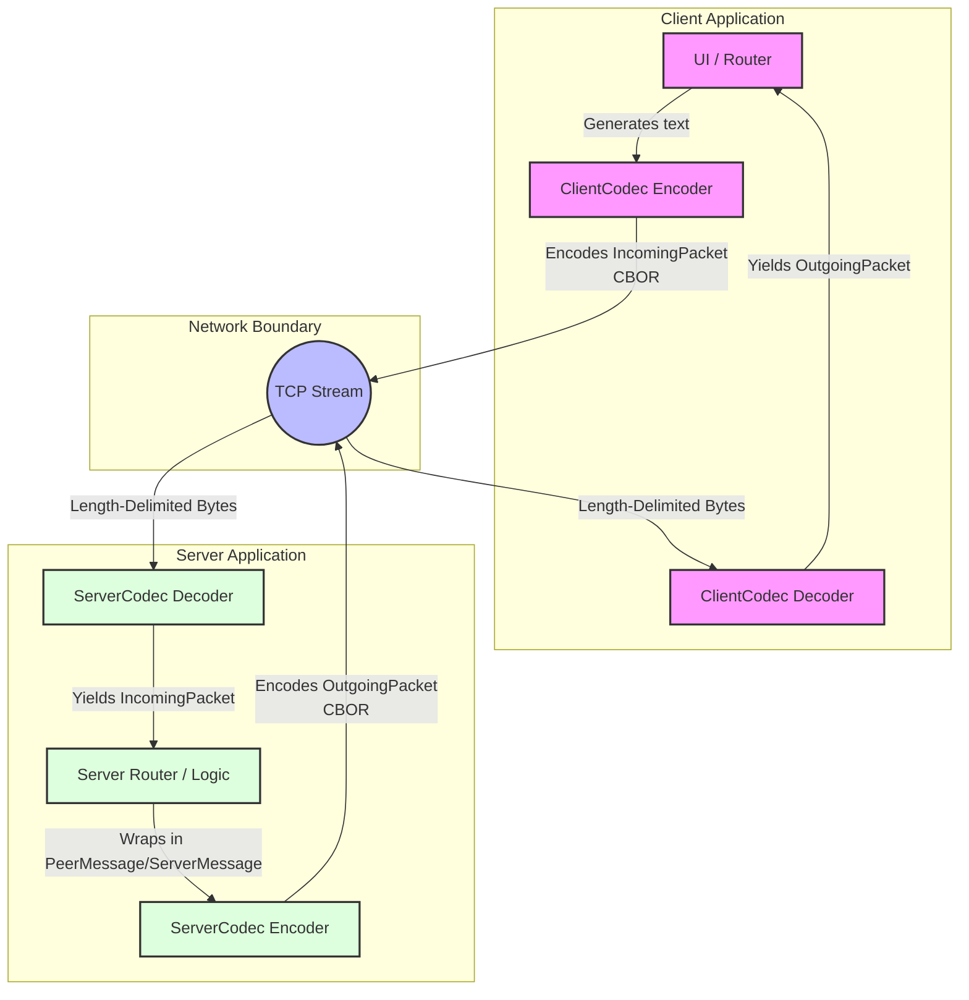
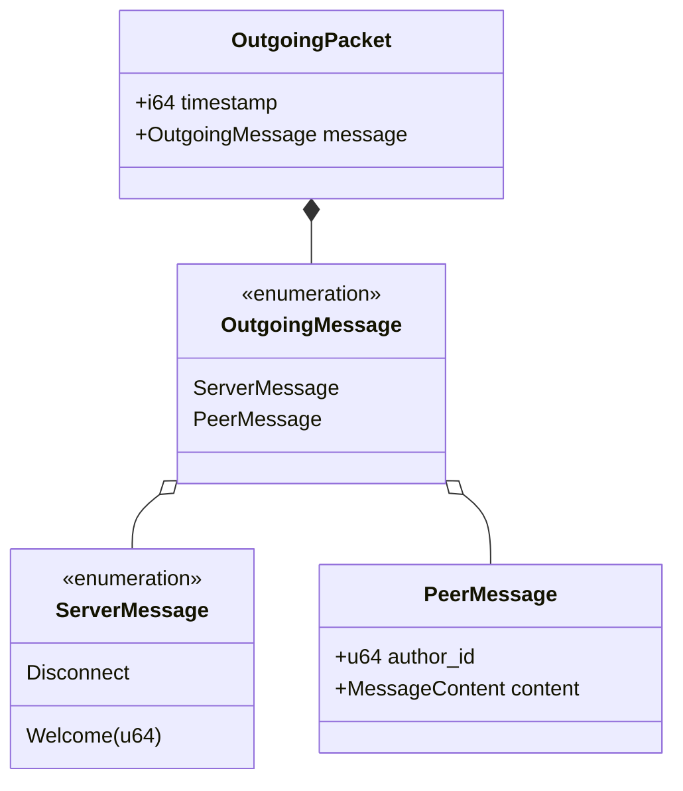
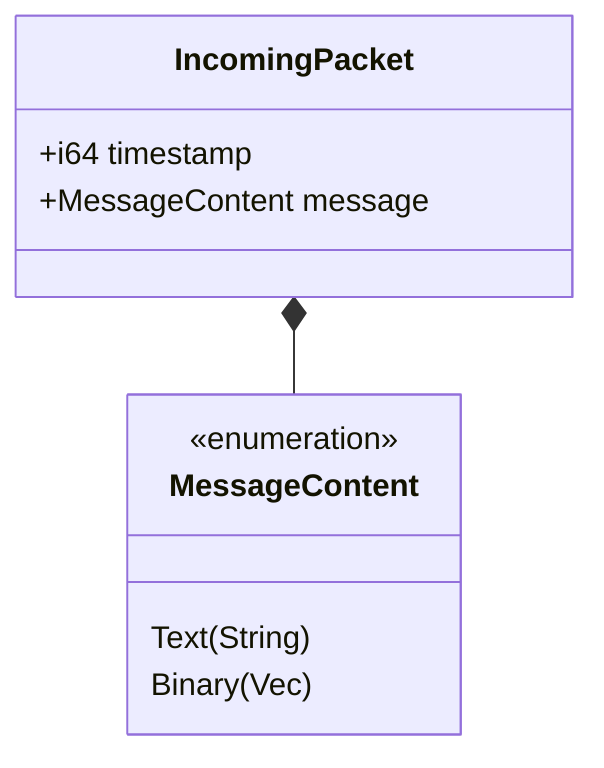

# Simple Chat Application

This project implements a simple chat application with a server and a TUI client.

## Backend

The backend utilizes an asynchronous, non-blocking architecture powered by `tokio`. To allow fast concurrent interactions, the application separates the logic into two primary components communicating exclusively via asynchronous channels:

### 1. Core Server Task
The core server runs as a standalone loop continuously observing the network state. Its primary role is **message multiplexing and routing**. 
- It houses the receiving end of a Multi-Producer Single-Consumer (MPSC) channel. This acts as an inbox for any action occurring on the network.
- As it processes requests arriving in this inbox, it determines the proper protocol action and forwards the payload into a massive `broadcast` channel.
- Because it utilizes message passing instead of shared state locks, the core router remains completely lock-free and highly performant.

### 2. Client Worker Tasks
Whenever a user establishes a new TCP connection, the system immediately offloads the connection rigidly to a freshly spawned `tokio::spawn` worker task. This ensures clients are isolated from each other contextually. Inside the worker:
- **Upstream (Client -> Server)**: The task actively listens to the physical TCP stream. When bytes arrive, it uses the protocol codec to decode them into actionable envelopes, forwarding them into the core server's inbox (MPSC).
- **Downstream (Server -> Client)**: The task holds a subscription receiver to the core's broadcast channel. Whenever a message is centrally routed, this worker pulls it, serializes it to binary, and streams it physically over the socket.
- These operations happen simultaneously and reactively by utilizing `tokio::select!` loops—meaning an unresponsive client processing backlogs will not stall the overarching core application.

## TODO

- [ ] Usernames
- [ ] Server side chat history
- [ ] Authentication
- [ ] User ban/Blacklist
- [ ] Private messages
- [ ] Group chats
- [ ] File sharing

## Chat Protocol Definition

### Overview
This document describes the messaging protocol used between our client applications and the server. The architecture is logically split into an **application protocol** for domain routing and semantics, and a **wire-level remote protocol** that handles the physical serialization of binary data over TCP connections.

### Architecture

The networking interface relies on two distinct code boundaries:
- `protocol.rs`: Logical constructs encapsulating application interactions (e.g., `Message`, `Destination`, `Request`).
- `remote.rs`: Concrete wire formats (`IncomingPacket`, `OutgoingPacket`) and streaming utilities (`RemotePacketCodec`).

#### Message Flow Architecture



### Protocol Specifications

#### Wire Framing (Remote Protocol)
The system leverages `LengthDelimitedCodec` provided by `tokio-util`. This prepends every serialized chunk of data with its exact byte-length, which resolves traditional TCP overlapping, merging, and partial chunking edge cases.

The application encoding method uses **CBOR** (Concise Binary Object Representation) managed through the `ciborium` library over `serde`.

##### The Codec Interface
A single unified packet codec implements the transformation between the stream and the domain primitives.
```rust
pub struct RemotePacketCodec<In, Out> { ... }
```
- **ServerCodec**: Decodes `IncomingPacket` & Encodes `OutgoingPacket`.
- **ClientCodec**: Decodes `OutgoingPacket` & Encodes `IncomingPacket`.

#### Message Data Structures
To deal with state, timeframes, and peer isolation, primitive values (`MessageContent`) are progressively bundled within protective envelopes when traversing over the network wire.

##### Server-to-Client Broadcasting
The payloads are unified to simplify handling inside the isolated client processes.



##### Client-to-Server Publishing
Clients have a constrained communication pipeline, only capable of pushing base `MessageContent`. It relies on the server to append proper origin identities upon broadcasting.



### Typical Connection Lifecycle

1. **Bootstrap Handshake**: A client establishes a raw TCP loop.
2. **Acceptance Phase**: The listener accepts the socket. The new peer gets registered on the server and is streamed an initial `OutgoingPacket` encompassing a `ServerMessage::Welcome(u64)` which assigns the client its sequential numerical ID.
3. **Transmission Feed**:
   - The user inputs text -> The application wraps it in `IncomingPacket` -> Passes to Encoder.
   - Converts to CBOR, prefixes byte length frame, writes to socket.
   - The Server Decoder extracts the payload length and reconstructs the CBOR map synchronously.
   - The Server Router extracts the content, assigns the specific sender's `author_id`, constructs an `OutgoingMessage::PeerMessage`, serializes it inside an `OutgoingPacket`, and broadcasts it downstream to valid clients.
4. **Shutdown Iteration**: Either side triggers the close pipeline, eventually culminating in `OutgoingPacket(ServerMessage::Disconnect)`.